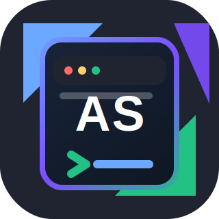
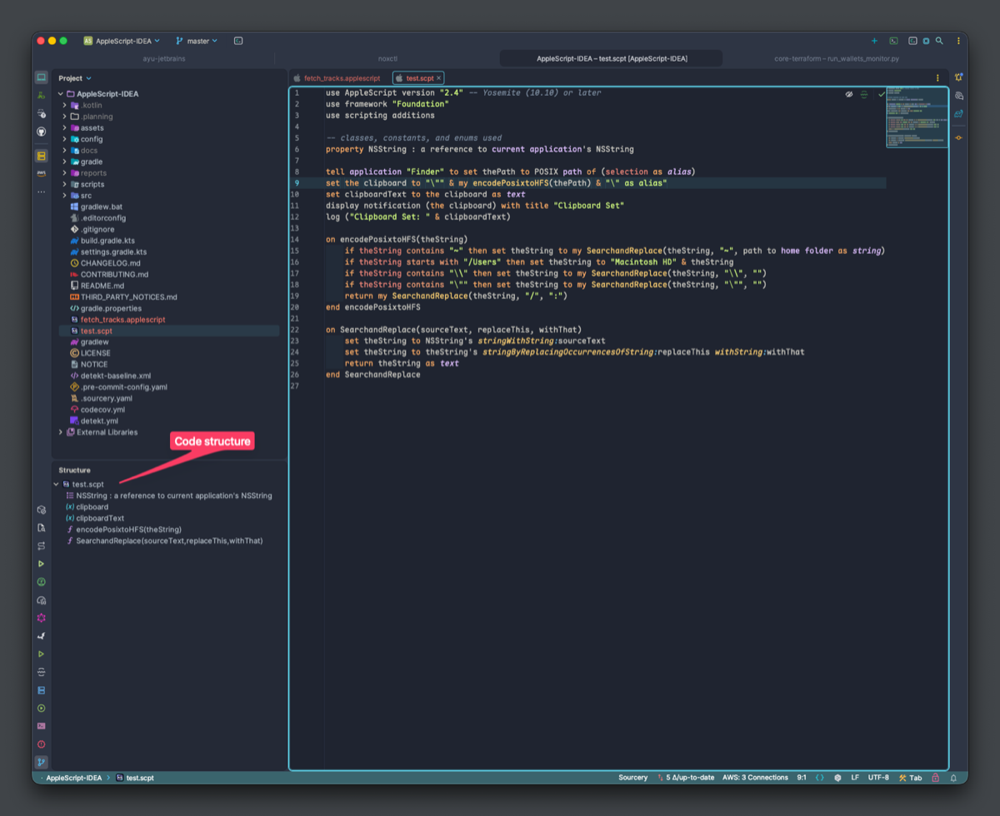
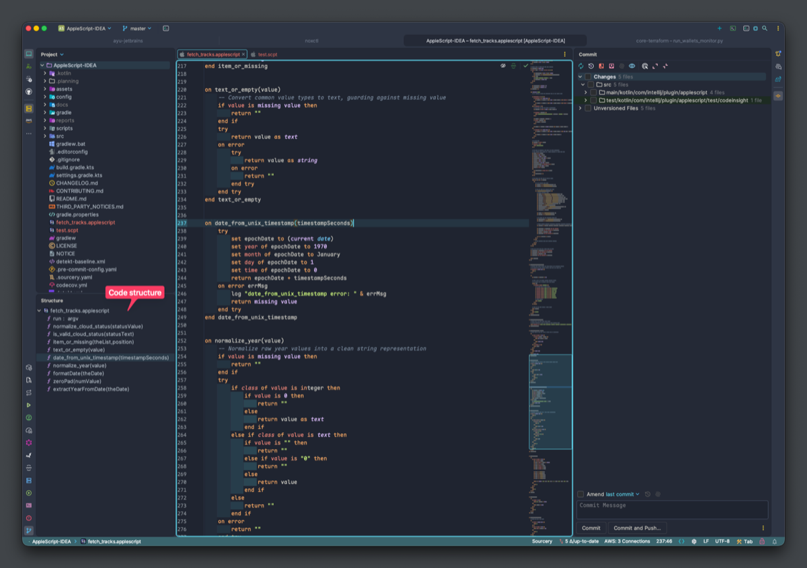
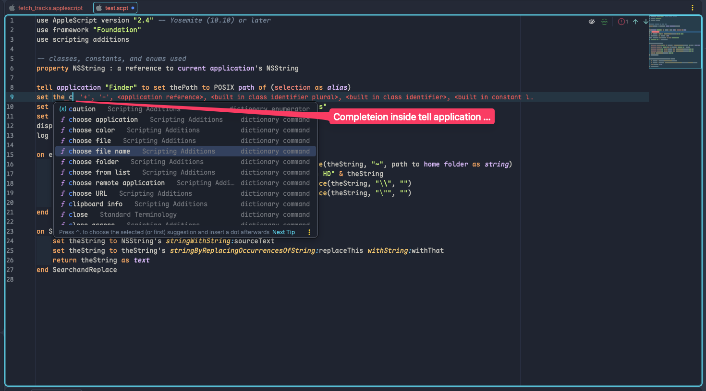
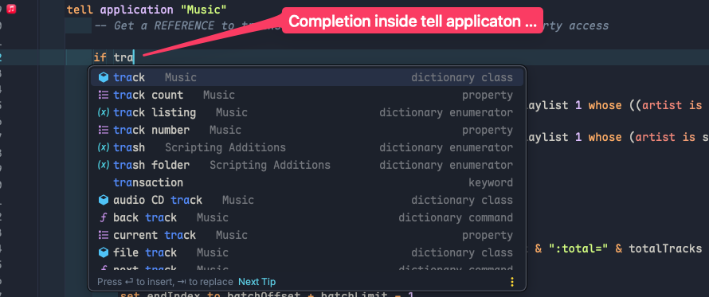
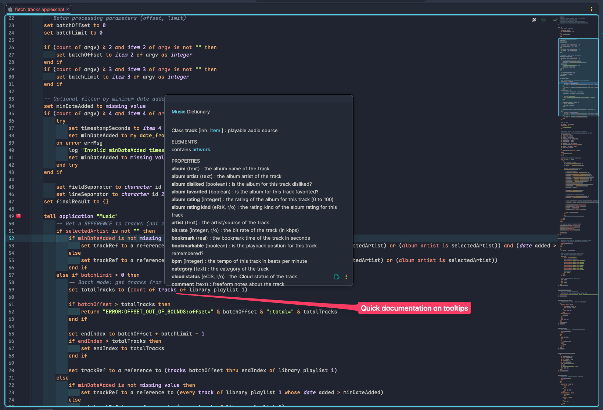
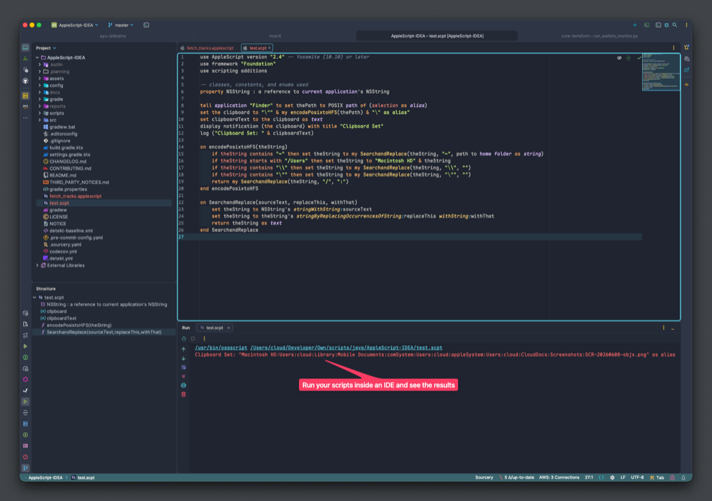
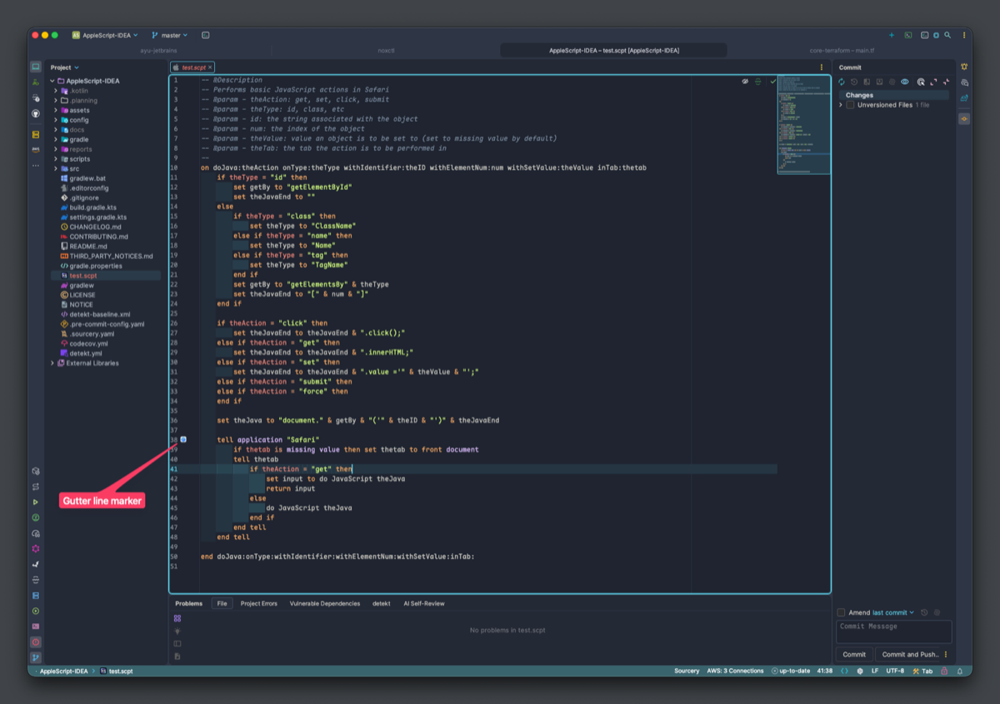

<p align="center">
  
</p>

<p align="center">
  <strong>AppleScript support for modern JetBrains IDEs.</strong>
</p>

<p align="center">
  <a href="https://plugins.jetbrains.com/plugin/32123-applescript-toolkit">
    
  </a>
</p>

<p align="center">
  <a href="https://github.com/barad1tos/AppleScript-JetBrains/actions/workflows/ci.yml">
    
  </a>
  <a href="https://codecov.io/gh/barad1tos/AppleScript-JetBrains">
    
  </a>
  <a href="https://plugins.jetbrains.com/plugin/32123-applescript-toolkit">
    
  </a>
  <a href="https://plugins.jetbrains.com/plugin/32123-applescript-toolkit">
    
  </a>
  <a href="LICENSE">
    
  </a>
</p>

<br>

AppleScript Toolkit brings AppleScript editing, code insight, dictionary tooling, and macOS script execution back to current JetBrains IDEs. It is for people who still automate real macOS workflows with AppleScript, but want the editing, navigation, and project ergonomics of IntelliJ IDEA instead of a separate script editor.

The project is a maintained revival of the original Apache-2.0 AppleScript plugin, with the handwritten IntelliJ Platform implementation modernized in Kotlin and the existing Grammar-Kit parser core preserved and hardened.

Long-term, I’d like to move toward some of the workflow capabilities people know from Script Debugger while staying within the IntelliJ Platform ecosystem. The current focus is the foundation for that path: reliable parsing, dictionary-aware completion and documentation, structure navigation, gutter actions, and script execution inside the IDE.

## What you get today

- **A JetBrains-native AppleScript workspace** — edit `.applescript` and `.scpt` files with syntax highlighting, project navigation, structure view, and IDE run output.
- **Dictionary-aware code insight** — load scriptable-application dictionaries and `.sdef` / `.xml` files to drive completion, quick documentation, and application-specific terms.
- **Navigation for real scripts** — scan handlers, properties, script objects, and larger automation files without treating AppleScript as plain text.
- **macOS execution path** — run configurations execute scripts through the system AppleScript runtime and show results inside the IDE.
- **Modern plugin maintenance** — targets IntelliJ Platform 2025.1 through 2026.1 with current Gradle, Kotlin, CI, and Plugin Verifier coverage.

## Feature tour

| Preview | What it helps with |
|---------|--------------------|
|  | **AppleScript as an IDE language, not a text blob.** Syntax highlighting, parser-backed structure, and JetBrains project navigation work together for `.applescript` and `.scpt` files. |
|  | **Keep larger scripts navigable.** Structure View surfaces handlers and script sections so that long automation files are easier to scan, jump through, and maintain. |
| <br><br> | **Complete application terms where you actually write them.** Completion uses loaded application dictionaries and Scripting Additions data, including dictionary terms inside `tell application` blocks. |
|  | **Inspect dictionary details without breaking flow.** Quick documentation shows classes, elements, and properties from application dictionaries directly in the editor. |
| <br><br> | **Run and act from inside the IDE.** Run configurations execute scripts through the macOS AppleScript runtime, while gutter markers and editor actions keep script workflow close to the code. |

## Language Support

| Area       | Support                                                                                                                                                              |
|------------|----------------------------------------------------------------------------------------------------------------------------------------------------------------------|
| File types | `.applescript`, `.scpt`                                                                                                                                              |
| Syntax     | Highlighting for AppleScript keywords, literals, operators, handlers, tell blocks, and dictionary terms where available                                              |
| Parser     | Common AppleScript statements and expressions, Standard Additions object tokens, object references, handlers, `tell`, `try`, `whose`, and application-specific terms |
| Completion | Keywords, command names, command parameters, application names, and dictionary-backed terms                                                                          |
| Navigation | Structure view, documentation lookup, references, find usages, and rename where supported                                                                            |
| Runtime    | Run configurations using the macOS AppleScript runtime                                                                                                               |
| Templates  | Live templates for common AppleScript constructs                                                                                                                     |

## Compatibility

- Minimum: IntelliJ Platform `251` (JetBrains IDEs 2025.1)
- Maximum: IntelliJ Platform `261.*` (JetBrains IDEs 2026.1.x)
- JVM target: 17
- AppleScript execution and dictionary discovery require macOS

## Installation

### From JetBrains Marketplace

**Settings** → **Plugins** → **Marketplace** → search **"AppleScript Toolkit"** → **Install**

Restart the IDE after installation.

### From disk

1. Download the `.zip` from [Releases](https://github.com/barad1tos/AppleScript-JetBrains/releases/latest)
2. **Settings** → **Plugins** → **⚙** → **Install Plugin from Disk...**
3. Select the downloaded `.zip` and restart the IDE

## Usage Notes

On macOS, the plugin can run scripts through the system AppleScript runtime and can discover dictionaries from installed scriptable applications. On Linux or Windows, script execution and automatic macOS application discovery are unavailable, but manually loaded `.sdef` or `.xml` dictionary files can still provide dictionary-aware editing support.

Application dictionary indexing runs in the background. Completion may become available before the full application catalog has finished indexing.

Dictionary-aware completion depends on available SDEF data. If an application is missing, not scriptable, or exposes unusual dictionary markup, completion and documentation can be incomplete until the dictionary is loaded or a parser issue is fixed.

## Building from source

```bash
./gradlew buildPlugin        # Build the distribution ZIP
./gradlew test               # Run the test suite
./gradlew verifyPlugin       # Verify against configured IDE targets
```

Output: `build/distributions/AppleScript-IDEA-<version>.zip`

See [CONTRIBUTING.md](CONTRIBUTING.md) for guidelines and [CHANGELOG.md](CHANGELOG.md) for release history.

## Community

- Found a bug? [Open a bug report](https://github.com/barad1tos/AppleScript-JetBrains/issues/new?template=bug_report.yml)
- Have a feature idea? [Open a feature request](https://github.com/barad1tos/AppleScript-JetBrains/issues/new?template=feature_request.yml)
- Security issue? Use [GitHub Private Vulnerability Reporting](https://github.com/barad1tos/AppleScript-JetBrains/security/advisories/new)

## Relationship to the Original Project

This project is derived from the original AppleScript plugin by Andrey Dernov, distributed under the Apache License 2.0. The parser and lexer remain based on the existing Grammar-Kit/JFlex core. This maintained fork keeps the Apache-2.0 attribution while updating the implementation for current JetBrains IDEs.

The current maintained fork and modifications are Copyright 2025-2026 Roman Borodavkin and contributors.

This paid Marketplace line uses a new plugin id, `software.barad1tos.applescript.toolkit`, under the `barad1tos software` vendor profile. Existing users of the original listing will need to install this paid listing separately.

## Credits

- Maintained fork, Kotlin modernization, and parser hardening by Roman Borodavkin and contributors
- Original AppleScript plugin by Andrey Dernov, distributed under the Apache License 2.0
- IntelliJ Platform SDK by JetBrains

## License

[Apache 2.0](LICENSE) — see `LICENSE`, `NOTICE`, and `THIRD_PARTY_NOTICES.md`.
